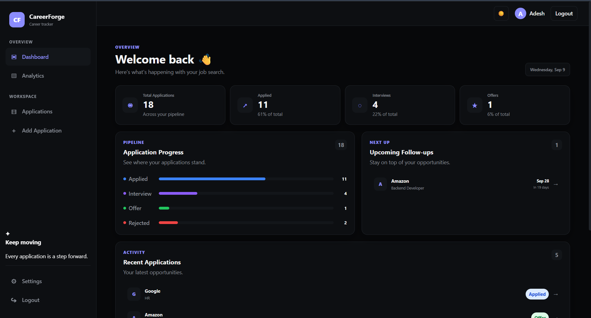
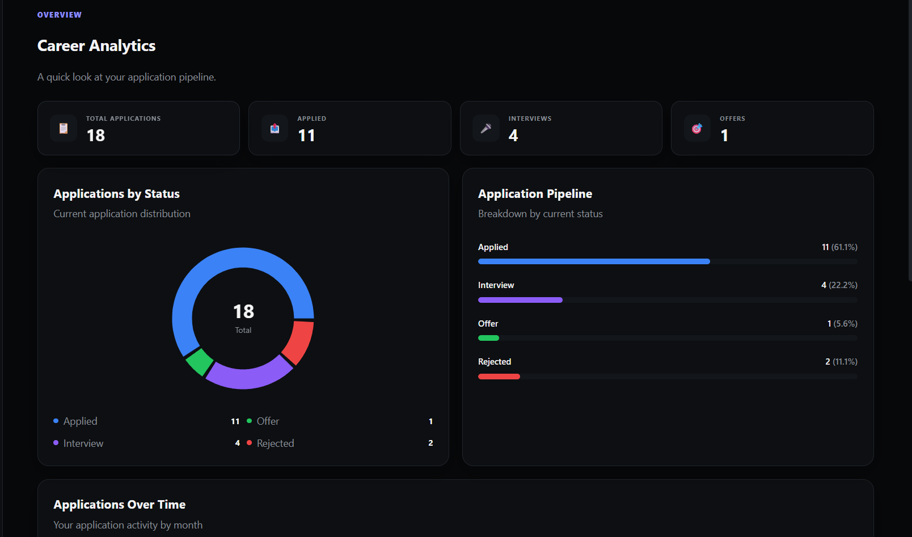
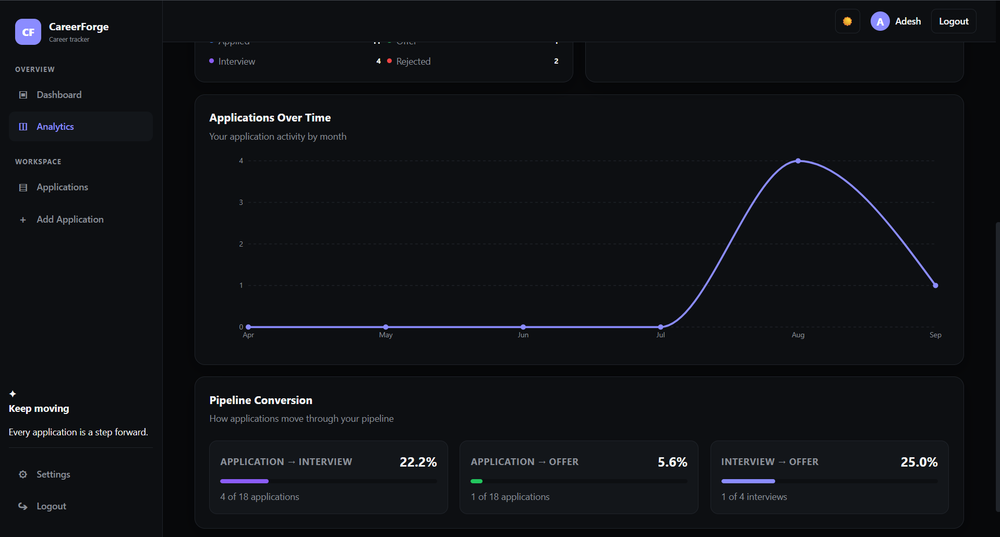
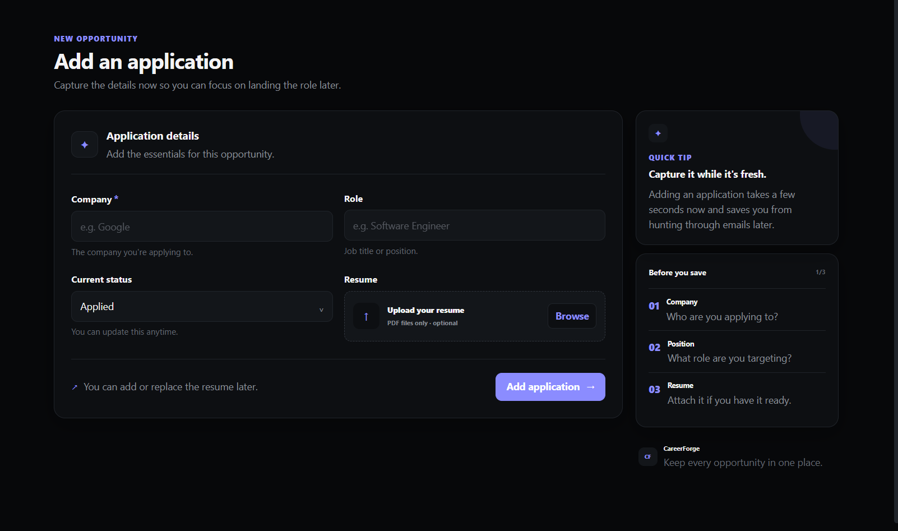

# CareerForge

A full-stack MERN job application tracking platform designed to help users organize their job search, track application progress, manage interviews and follow-ups, store resumes, and analyze application activity.

## Live Demo

**Frontend:** https://career-forge-teal.vercel.app/

**Backend API:** https://careerforge-api-54d1.onrender.com/

## Screenshots


### Dashboard



### Analytics





### Add Application



---

## Overview

CareerForge provides a centralized workspace for managing the job application process.

Users can **create and organize applications**, **track status changes**, **add notes**, **schedule follow-ups**, **manage interview rounds**, **upload resumes**, and **view analytics** about their application activity.

The project was built from scratch with an emphasis on understanding **full-stack application architecture**, **REST API design**, **authentication**, **database modeling**, **validation**, **authorization**, **file uploads**, **error handling**, and **frontend-backend integration**.

---

## Features

### Authentication & Security

- User registration and login
- **Password hashing with bcrypt**
- **JWT-based authentication**
- Protected API routes
- **User-specific application data**
- **Resource ownership checks**
- Request validation
- Centralized error handling

### Application Management

- Create job applications
- View all applications
- View individual application details
- Update applications
- Delete applications
- **Search applications by company**
- **Filter applications by status**
- **Filter applications by date range**
- **Sort applications**
- **Pagination**
- Pagination limit protection

### Application Tracking

- **Track application status**
- **Maintain status history**
- Add application notes
- **Set follow-up dates**
- **Retrieve upcoming follow-ups**
- **Application analytics**
- Applications-over-time data

### Resume Management

- **Upload resumes**
- **PDF-only file validation**
- **Resume file size limits**
- View uploaded resumes
- **User-specific resume access**

### Interview Management

- Add interviews to applications
- **Track interview rounds**
- **Track interview dates**
- **Track interview types**
- **Track interview outcomes**
- Add interview notes
- Update interviews
- Delete interviews

### Frontend

- **React component-based architecture**
- Reusable components
- Controlled form inputs
- Dynamic list rendering
- **Application details view**
- **Interview management UI**
- **Analytics dashboard**
- Filtering and pagination UI
- **Responsive layout**
- **Dark/light theme support**

---

## Tech Stack

### Backend

- **Node.js**
- **Express.js**
- **MongoDB**
- **Mongoose**
- **JSON Web Tokens (JWT)**
- **bcrypt**
- **Multer**
- **dotenv**

### Frontend

- **React**
- **Vite**
- **JavaScript**
- **Recharts**

### Development & Deployment

- **Git**
- **GitHub**
- **Postman**
- **Vercel**
- **Render**
- **MongoDB Atlas**

---

## Architecture

```text
                    ┌─────────────────────┐
                    │   React Frontend    │
                    │       Vercel        │
                    └──────────┬──────────┘
                               │
                               │ HTTPS / REST API
                               ▼
                    ┌─────────────────────┐
                    │   Express Backend   │
                    │       Render        │
                    └──────────┬──────────┘
                               │
                               │ Mongoose
                               ▼
                    ┌─────────────────────┐
                    │    MongoDB Atlas    │
                    └─────────────────────┘
```

## Project Structure
```text
careerForge/
│
├── src/
│   ├── app.js
│
│   ├── config/
│   │   └── db.js
│
│   ├── controllers/
│   │   ├── applicationController.js
│   │   └── userController.js
│
│   ├── middleware/
│   │   ├── authMiddleware.js
│   │   ├── uploadMiddleware.js
│   │   └── validation/
│   │       └── applicationValidation.js
│
│   ├── models/
│   │   ├── Application.js
│   │   └── User.js
│
│   ├── routes/
│   │   ├── applicationRoutes.js
│   │   └── userRoutes.js
│
│   └── utils/
│       └── asyncHandler.js
│
├── frontend/
│   ├── public/
│   └── src/
│       ├── components/
│       ├── assets/
│       ├── App.jsx
│       └── main.jsx
│
├── uploads/
│   └── .gitkeep
│
├── .env.example
├── .gitignore
├── package.json
├── package-lock.json
└── README.md
```
---

## Running Locally

### Prerequisites

Make sure you have:

- **Node.js**
- **npm**
- **MongoDB** or a MongoDB Atlas database
- **Git**
- Postman (optional)

### 1. Clone the repository

Clone the repository and move into the project directory.

`git clone https://github.com/Adeshprasad/careerForge.git`

`cd careerForge`

### 2. Install backend dependencies

From the project root:

`npm install`

### 3. Configure backend environment variables

Create a `.env` file in the project root:

```env
PORT=3000
MONGODB_URI=your_mongodb_connection_string
JWT_SECRET=your_jwt_secret
FRONTEND_URL=http://localhost:5173
```

**Do not commit `.env` to Git.**

A `.env.example` file is included as a reference.

### 4. Start the backend

For development:

`npm run dev`

Or:

`npm start`

The backend will run on:

`http://localhost:3000`

### 5. Install frontend dependencies

Open another terminal:

`cd frontend`

`npm install`

### 6. Configure frontend environment variables

Create:

`frontend/.env`

with:

```env
VITE_API_URL=http://localhost:3000
```

### 7. Start the frontend

From the `frontend` directory:

`npm run dev`

Vite will provide a local development URL, typically:

`http://localhost:5173`

---

## Environment Variables

### Backend

| Variable | Description |
|---|---|
| **`PORT`** | Port used by the Express server |
| **`MONGODB_URI`** | MongoDB connection string |
| **`JWT_SECRET`** | Secret used to sign and verify JWT tokens |
| **`FRONTEND_URL`** | Allowed frontend origin for CORS |

### Frontend

| Variable | Description |
|---|---|
| **`VITE_API_URL`** | Base URL of the backend API |

For local development:

`VITE_API_URL=http://localhost:3000`

For production, the frontend uses the deployed Render API URL through the **Vercel environment configuration**.

---

## API Overview

**Protected application routes require a valid JWT.**

The token should be provided using the `Authorization` header:

`Authorization: Bearer <token>`

### Authentication

| Method | Endpoint | Description |
|---|---|---|
| `POST` | `/users/register` | Register a new user |
| `POST` | `/users/login` | Login and receive a JWT |

### Applications

| Method | Endpoint | Description |
|---|---|---|
| `GET` | `/applications` | Fetch applications |
| `GET` | `/applications/:id` | Fetch one application |
| `POST` | `/applications` | Create an application |
| `PATCH` | `/applications/:id` | Update an application |
| `DELETE` | `/applications/:id` | Delete an application |

### Application Features

| Method | Endpoint | Description |
|---|---|---|
| `GET` | `/applications/analytics` | Get application analytics |
| `GET` | `/applications/follow-ups` | Get upcoming follow-ups |
| `GET` | `/applications/:id/resume` | View application resume |

### Interviews

| Method | Endpoint | Description |
|---|---|---|
| `POST` | `/applications/:id/interviews` | Add an interview |
| `PATCH` | `/applications/:id/interviews/:interviewId` | Update an interview |
| `DELETE` | `/applications/:id/interviews/:interviewId` | Delete an interview |

---

## Application Query Features

The applications endpoint supports **filtering**, **searching**, **sorting**, and **pagination**.

### Filter by status

`GET /applications?status=Interview`

Supported statuses:

- `Applied`
- `Interview`
- `Rejected`
- `Offer`

### Search by company

`GET /applications?company=Microsoft`

Company searches are **case-insensitive**.

### Filter by date range

`GET /applications?from=2026-08-01&to=2026-08-31`

Either `from`, `to`, or both can be provided.

### Pagination

`GET /applications?page=1&limit=10`

The response includes pagination metadata such as:

- **Current page**
- **Limit**
- **Total applications**
- **Total pages**
- **Whether a next page exists**
- **Whether a previous page exists**

The maximum page size is limited to **50 applications**.

### Sorting

Ascending:

`GET /applications?sort=createdAt`

Descending:

`GET /applications?sort=-createdAt`

---

## Validation & Error Handling

CareerForge validates incoming application data before allowing it to reach the database.

The backend also uses **centralized error handling** to provide consistent API responses.

Example:

```json
{
  "success": false,
  "message": "Application not found"
}
```

The API handles cases such as:

- **Invalid application IDs**
- Missing resources
- **Invalid status values**
- **Invalid dates**
- **Invalid sorting parameters**
- **Invalid pagination values**
- **Invalid interview IDs**
- **Unauthorized resource access**
- **Invalid file uploads**

---

## Resume Uploads

CareerForge supports resume uploads using **Multer**.

Current restrictions:

- **Only PDF files are accepted**
- **Maximum file size is 5 MB**
- Uploaded files are excluded from Git
- `uploads/.gitkeep` keeps the upload directory present in the repository

The current implementation uses **filesystem storage**.

> **Deployment note:** the current resume storage approach is suitable for local development and demonstration, but persistent object storage would be a better solution for long-term production use.

---

## Testing

API functionality has been tested using **Postman**, including:

- User registration
- User login
- **JWT-protected routes**
- Application creation
- Application retrieval
- Application updates
- Application deletion
- Company search
- Status filtering
- Date filtering
- Sorting
- Pagination
- Invalid pagination values
- Invalid dates
- Invalid status values
- Invalid sorting values
- Invalid application IDs
- Missing applications
- Resume uploads
- Interview creation
- Interview updates
- Interview deletion
- Invalid interview IDs
- Error handling

---

## Deployment

CareerForge is deployed using the following architecture:

| Component | Platform |
|---|---|
| **Frontend** | Vercel |
| **Backend API** | Render |
| **Database** | MongoDB Atlas |

### Production URLs

**Frontend:**  
https://career-forge-teal.vercel.app/

**Backend API:**  
https://careerforge-api-54d1.onrender.com/

The frontend communicates with the backend through the **`VITE_API_URL`** environment variable, while the backend uses **`FRONTEND_URL`** to configure CORS.

---

## Future Improvements

Potential future improvements include:

- **Persistent cloud storage for resumes**
- Automated application reminders
- Email notifications
- Advanced analytics
- Job board integrations
- Application activity timeline
- Automated resume organization
- More granular user preferences

---

## Development Focus

CareerForge was developed with an emphasis on understanding how a **full-stack application works across its individual layers**.

Key areas explored during development include:

- **Backend architecture**
- **REST API design**
- **MongoDB data modeling**
- **Authentication and authorization**
- **JWT implementation**
- **Input validation**
- **Error handling**
- **File uploads**
- **Pagination**
- **Filtering and sorting**
- **Status tracking**
- **Interview tracking**
- **Analytics**
- **Frontend-backend integration**
- **API testing**
- **Edge-case handling**
- **Production deployment**

The goal was to build the system from the ground up while understanding the engineering decisions behind each layer rather than simply assembling a collection of features.

---

## License

This project is for educational and portfolio purposes.